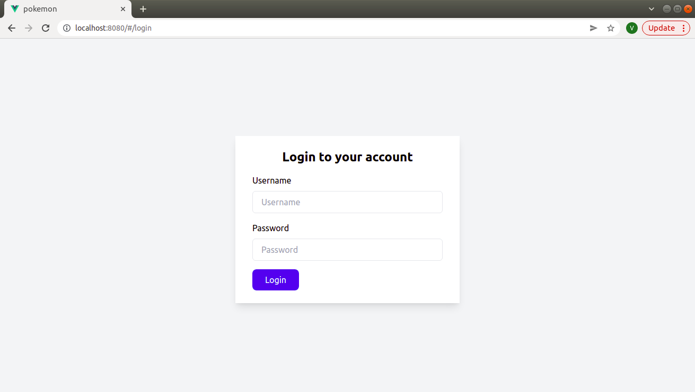
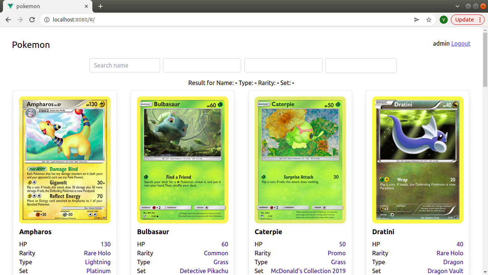

# pokemon

This is vue.js demo aplication to browse Pokemon database from
https://pockemontcg.io

## Project setup
```
npm install
```

### Compiles and hot-reloads for development
```
npm run serve
```

### Compiles and minifies for production
```
npm run build
```

### Lints and fixes files
```
npm run lint
```

### Credentials

Use username `admin` and password `admin` to login

### Known Issues

Sometimes, API endpoint reply without `Access-Control-Allow-Origin` response header which causing CORS issue with Axios. Nothing we can do about it. If that case, try to refresh browser.

### Screenshots





### Customize configuration
See [Configuration Reference](https://cli.vuejs.org/config/).
